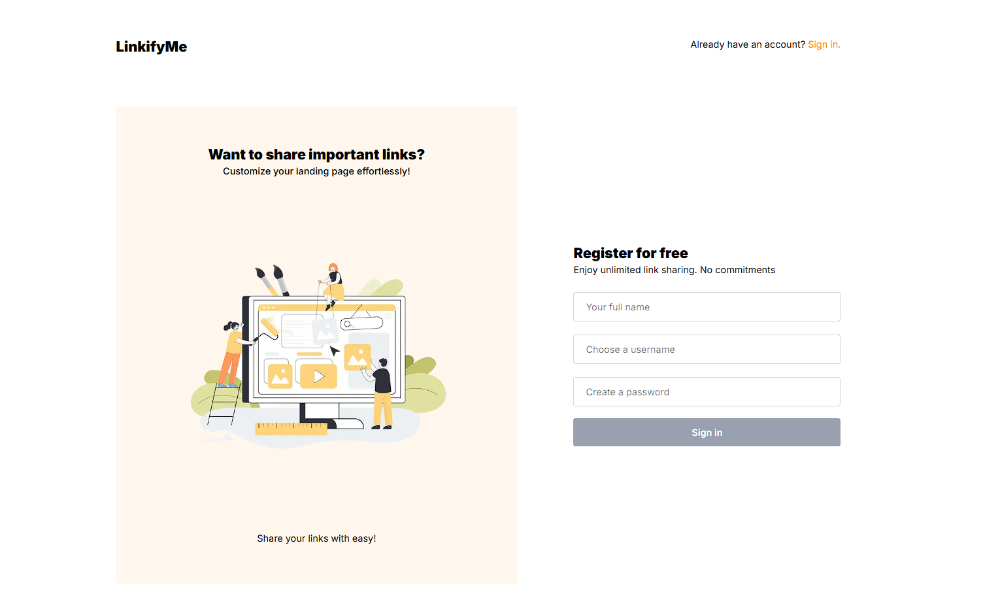
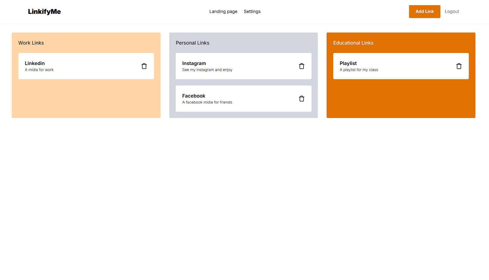

# 💻 Frontend - Next.js

This is the frontend project of the application, developed with [Next.js](https://nextjs.org/). It provides the user interface of the application.

## 🚀 Technologies

- React + Next.js
- TypeScript
- Tailwind CSS

## ✅ Prerequisites

- Node.js 18+
- Yarn (or npm)

## 📦 How to run this front-end

1. In the root of this folder, run `npm install` and install the dependencies.
2. Configure the .env, there is a `.env.example` with the necessary variables.
3. Run your application using the `npm run dev` command.
4. Access the /login route.
5. If everything went well, you will arrive at this screen:

## Screenshot

